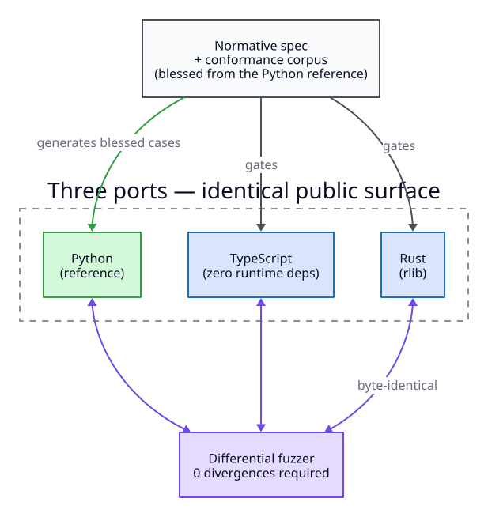

# The theory model

The `music_dsl` package is the theory core the lead-sheet language sits on. Its
centerpiece is the pair of chord models — **`Chord`** (absolute) and
**`NumericChord`** (key-relative) — which turn a chord token into a structured,
queryable value and let you move harmony between keys. Scale degrees, scales, and
realization are the supporting tools around them. This page describes the model;
the [API reference](api.md) has the generated per-symbol docs.

## Chords

`Chord` parses a chord token (e.g. `"D-7"`, `"Ab^7"`, `"C7alt"`, `"D-/C"`) into a
structured value: a `root` (a `Notes`), a triad quality, extension degrees, a
`HarmonicFunction`, and a bit-packed **encoding** that membership and diatonicity
queries operate on.

```python
from music_dsl.domain.chords.chord import Chord

c = Chord("D-7")
c.root                 # -> Notes.D
c.triad                # -> Triad.Minor
c.extensions           # -> ()
c.harmonic_function    # -> HarmonicFunctions.Subdominant

Chord("C7alt").extensions          # -> (Extensions.alt,)
Chord("C7alt").harmonic_function   # -> HarmonicFunctions.Dominant
Chord("Ab^7").harmonic_function    # -> HarmonicFunctions.Tonic
```

The bare `harmonic_function` is decided from quality alone; `harmonic_function_in_key`
sharpens it against a key. `Chord` is the **executable definition of chord validity**:
the lead-sheet layer's `is_valid_chord` delegates to this parser. The grammar is
permissive by design — see the [DSL page](dsl.md) for the accepted/rejected token
catalog.

## Numeric (key-relative) chords

`NumericChord` is the flagship: a chord expressed **relative to a key** rather than
at an absolute pitch — its root is a `ScaleDegree` (a roman numeral) instead of a
`Notes`. The same `NumericChord` realizes to different absolute chords in different
keys, which is what makes it the right form for transposition, analysis, and
key-independent chart storage.

```python
from music_dsl.domain.chords.numeric_chord import NumericChord
from music_dsl import Notes

ii = NumericChord.from_chord_string("ii-7")
ii.root                 # -> ScaleDegree.ii
ii.harmonic_function    # -> HarmonicFunctions.Subdominant
ii.in_key(Notes.C)      # -> D-7
ii.in_key(Notes.Eb)     # -> F-7
```

A whole **ii–V–I**, realized across two keys — same numerals, different pitches, same
functions:

| Numeral | `HarmonicFunction` | `.in_key(C)` | `.in_key(Eb)` |
|---------|--------------------|--------------|----------------|
| `ii-7`  | Subdominant | D-7 | F-7 |
| `V7`    | Dominant    | G7  | Bb7 |
| `bVII7` | Dominant    | Bb7 | Db7 |

Realization is by pitch class (flat-spelled; slash chords resolve recursively against
major parents). `harmonic_function_in_key` goes the other direction — from an absolute
chord in a key to its function.

## Notes and intervals

`Notes` is an enum of the twelve pitch classes, carrying both sharp and flat
spellings (`C#` and `Db` are distinct members but compare **enharmonically
equal**). `.to_flat()` / `.normalized()` collapse a sharp spelling to its flat
equivalent, which is the canonical form the rest of the model works in (there are
no double accidentals).

`Intervals` names the interval qualities/sizes; interval arithmetic is exposed
through helpers like `semitones_apart_ascending` and, on the realization side,
`interval_pitches`.

## Scale degrees

`ScaleDegree` is an enum of roman-numeral degrees (`I`, `ii`, `bIII`, `#IV`, …),
carrying both major (uppercase) and minor (lowercase) spellings and both
sharp/flat enharmonic spellings, with the inverse maps derived so the two
directions cannot drift. Scale degrees are what `NumericChord` roots are built
from, and what harmonic-function analysis reports against.

## Keys, scales, and realization

A `Key` is a `(root, scale)` pair. Scales are modeled as bit-masks (see the
[scale catalog](scales.md) for the representation and the full 39-scale set).
Two families of query sit on top:

- **Membership** — `contains(scale, pitch_class)` is defined for **every** scale.
- **Function** — `is_diatonic` and `harmonic_function_in_key` are defined **only**
  for scales with a tonal hierarchy, and **refuse** on symmetric/atonal scales.
  This is the two-tier model, covered in depth on the [scale page](scales.md).

The realization layer turns abstract theory into concrete pitches and
frequencies: `note_to_midi`, `midi_to_hz`, `note_to_hz`, `interval_pitches`,
`chord_pitches`, `scale_pitches`, and `scale_degree_pitch`.

## Cross-port surface

The same model is implemented in all three ports, kept identical by the shared
conformance corpus and the differential fuzzer:

{ loading=lazy }

Names differ only by each language's idiom:

| Concept | Python | TypeScript | Rust |
|---------|--------|-----------|------|
| Chord parse | `Chord` / `parse_chord` | `parseChord` / `ChordModel` | `parse_chord` / `ChordModel` |
| Diatonic query | `is_diatonic` | `isDiatonic` | `is_diatonic` |
| Harmonic function in key | `harmonic_function_in_key` | `harmonicFunctionInKey` | `harmonic_function_in_key` |
| Scale catalog | `Scales` | `Scales` | `Scales` |

Identical scale masks across ports guarantee identical membership and
diatonicity results — which the differential fuzzer verifies over the whole scale
surface.
